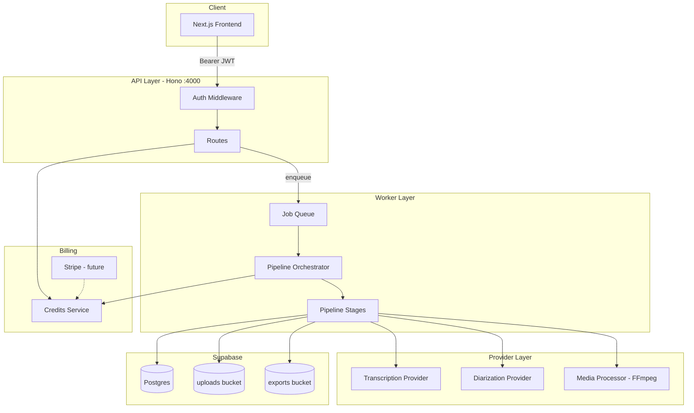

# Captionovo Backend Architecture

This document describes the processing and billing architecture scaffolded in `backend/src/`. Implementation is staged: interfaces and orchestration are in place; external providers (Deepgram, FFmpeg, Stripe) plug in behind them.

## System overview



## Directory layout

```
backend/src/
├── domain/           # Shared types (processing, billing)
├── routes/           # HTTP handlers (thin — delegate to services)
├── jobs/             # Job queue + worker runner
├── pipeline/         # Orchestrator + stage implementations
├── providers/        # Swappable STT / diarization / FFmpeg adapters
├── services/         # Credits ledger, billing (Stripe)
├── worker/           # Standalone worker entry point
└── lib/              # Auth, env, Supabase, mappers
```

## Processing pipeline

### Trigger

1. User uploads media → `POST /projects/:id/upload-url`
2. User starts job → `POST /projects/:id/process`
3. API enqueues a `project_pipeline` job (DB row or inline fallback)
4. Worker runs `PipelineOrchestrator.run(payload)`

### Stage graph

Stages are selected from `project.outputs`:

| Output flag | Stages added |
|-------------|--------------|
| always | `extracting_audio` → `detecting_language` → `transcribing` |
| `speaker_labels` | `diarizing_speakers` |
| `subtitles`, `burned_video` | `generating_subtitles` |
| `summary`, `repurpose` | `generating_summary` |
| `burned_video` | `rendering_video` |
| always | `preparing_editor` → `completed` |

Each stage:
- Updates `projects.processing_state`
- Writes domain data (`transcript_segments`, `speakers`, `subtitle_segments`, `exports`)
- Uses provider interfaces (currently **stub** implementations)

### Provider interfaces

| Interface | Responsibility | Current impl |
|-----------|----------------|--------------|
| `TranscriptionProvider` | Speech-to-text | `providers/stub` |
| `DiarizationProvider` | Speaker assignment | `providers/stub` |
| `MediaProcessor` | FFmpeg extract / burn-in | `providers/stub` |

Switch provider via `TRANSCRIPTION_PROVIDER` env (future: `deepgram`, `assemblyai`).

### Job queue

| Mode | When | How |
|------|------|-----|
| **Inline** | Dev / no migration | Job runs in API process after enqueue |
| **DB queue** | After migration applied | `processing_jobs` table + optional `npm run worker` poller |

Migration: `supabase/migrations/20260621130000_processing_jobs_and_billing.sql`

## Billing architecture

### Credits model

- **1 credit = 1 minute** of source media
- **Reserve** at project create (credit check)
- **Commit** on pipeline success via `CreditsService.commitUsage()`
- **Grant** on purchase via `CreditsService.grantCredits()`

### Ledger

`credit_transactions` records all movements:

| `transaction_type` | Meaning |
|--------------------|---------|
| `usage` | Minutes consumed by a project |
| `purchase` | Stripe checkout completed |
| `bonus` | Promotional grant |
| `refund` | Manual / Stripe refund |
| `adjustment` | Admin correction |

### Billing API

| Method | Route | Auth | Status |
|--------|-------|------|--------|
| GET | `/billing/transactions` | Yes | Live |
| GET | `/billing/packs` | Yes | Live (defaults if no DB) |
| POST | `/billing/checkout` | Yes | Stub → 501 until Stripe |
| POST | `/billing/webhook` | Stripe signature | Stub → 501 until Stripe |

### Stripe integration (next)

1. Create Checkout Session in `BillingService.createCheckoutSession`
2. Webhook `checkout.session.completed` → `grantCredits(userId, pack.credits, 'purchase')`
3. Store `stripe_customer_id` on `profiles`

Env: `STRIPE_SECRET_KEY`, `STRIPE_WEBHOOK_SECRET`

## Editor & export API

| Method | Route | Purpose |
|--------|-------|---------|
| PATCH | `/projects/:id/transcript/segments/:segmentId` | Edit transcript |
| PATCH | `/projects/:id/speakers/:speakerId` | Rename speaker |
| GET | `/projects/:id/exports` | List export status |
| POST | `/projects/:id/exports` | Queue export job |

Export generation (`job_type: export`) is stubbed — same queue pattern as pipeline.

## Deployment topology

```
┌─────────────────┐     ┌─────────────────┐
│  API (Hono)     │     │  Worker         │
│  npm run dev:be │     │  npm run worker │
└────────┬────────┘     └────────┬────────┘
         │                       │
         └───────────┬───────────┘
                     ▼
              Supabase (DB + Storage)
```

For production, run API and Worker as separate processes/containers. Both need `SUPABASE_SERVICE_ROLE_KEY`.

## Implementation roadmap

### Phase 1 — Architecture (this PR)
- [x] Pipeline orchestrator + stages
- [x] Provider interfaces + stubs
- [x] Job queue scaffold
- [x] Credits service + billing routes
- [x] Transcript / export route stubs
- [ ] Apply DB migration via Supabase MCP

### Phase 2 — Real transcription
- [ ] Deepgram or AssemblyAI provider (Hindi/Hinglish)
- [ ] FFmpeg media processor (audio extract, duration probe)
- [ ] Persist real duration + word-level timestamps

### Phase 3 — Subtitles & burn-in
- [ ] Subtitle chunking / line breaking
- [ ] SRT/VTT writers
- [ ] FFmpeg subtitle burn-in → `exports` bucket

### Phase 4 — Billing
- [ ] Stripe Checkout + webhook
- [ ] Wire frontend "Buy credits" button

### Phase 5 — Scale
- [ ] Move queue to BullMQ / Inngest if needed
- [ ] Separate worker autoscaling
- [ ] Processing complete notifications
